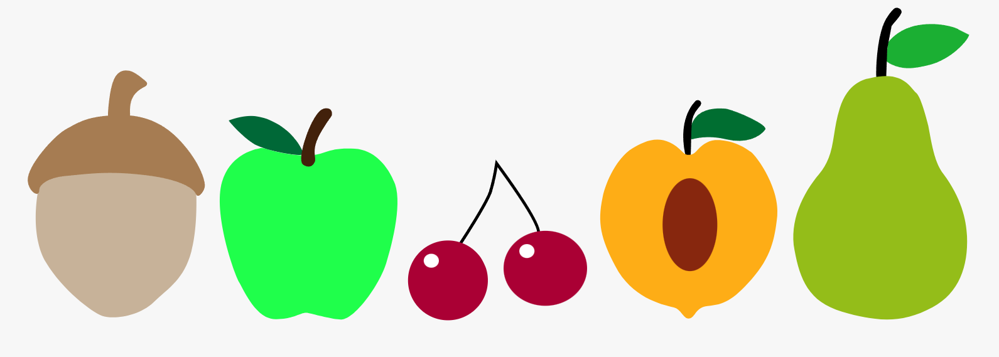

# Nathalia Lima - Interactive Svg Icons
This repo is for Multimedia Authoring 2 Hw #1 – Interactive Svg Icons

___

## About the project

This website was created to present interactions in SVG icons, as well as display messages in the browser console when clicking on one of them.

___

## Installation

There is no installation required.

## Usage

Open index.html in the browser of your choice.

## Contributing

1. Fork it!
2. Create your feature branch: `git checkout -b my-new-feature`
3. Commit your changesL `git commit -am 'Add some feature'`
4. Push to the branch: `git push origin my-new-feature`
5. Submit a pull request :D

## History

February 1st, 2024

## Credits

Nathalia Lima

## License

MIT - please see [license file](LICENSE).